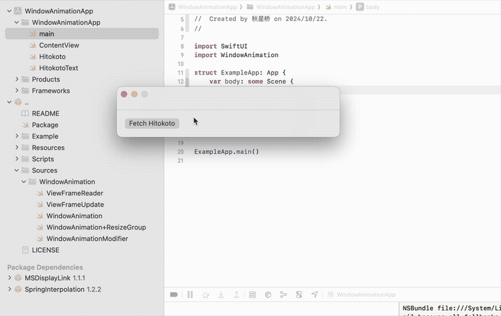

# WindowAnimation

WindowAnimation is a library designed to create animations when resizing SwiftUI windows on macOS.



## Usage

To use this library, add the package to your project and then import it.

```swift
[
    .package(url: "https://github.com/Lakr233/WindowAnimation", from: "1.0.0"),
]

import WindowAnimation // requires macOS 11.0 or later
```

### Using `WindowAnimationResizeGroup`

If you are using macOS 13.0 or later, you can replace `WindowGroup` with `WindowAnimationResizeGroup`, provided your app doesn’t require a customized `WindowGroup`. This is all that is necessary.

```swift
struct ExampleApp: App {
    var body: some Scene {
        WindowAnimationResizeGroup {
            ContentView()
        }
        .windowStyle(.hiddenTitleBar)
        // .windowResizability(.contentSize) <- remove this line
    }
}
```

### Using `WindowAnimationModifier` & Setting Up `WindowGroup` Manually

For earlier versions of macOS or if you have customized your `WindowGroup`, apply the `WindowAnimationModifier` to the root of your view.

```swift
WindowGroup {
    ContentView()
        .modifier(WindowAnimationModifier())
}
.windowResizability(.contentSize) // required for macOS 13.0 or later
```

## Customization

There are parameters within the initializers. See examples below.

```swift
WindowAnimationResizeGroup(speed: 10, alignment: .center)
WindowAnimationModifier(speed: 4.0, alignment: .bottom)
```

## License

[MIT License](./LICENSE)

---

Copyright © 2024 Lakr Aream. All Rights Reserved.
