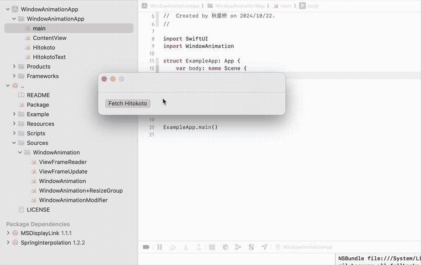

# WindowAnimation

WindowAnimation is a library designed to create animations when resizing SwiftUI windows on macOS.



## Requirements

- macOS 12.0 or later
- Swift 6.2 or later (Swift 6 language mode)

## Usage

To use this library, add the package to your project and then import it.

```swift
[
    .package(url: "https://github.com/Lakr233/WindowAnimation", from: "2.0.0"),
]

import WindowAnimation
```

### Using `WindowAnimationResizeGroup`

If you are using macOS 13.0 or later, you can replace `WindowGroup` with `WindowAnimationResizeGroup`, provided your app doesn’t require a customized `WindowGroup`. This is all that is necessary.

```swift
struct ExampleApp: App {
    var body: some Scene {
        WindowAnimationResizeGroup {
            ContentView()
        }
        .windowStyle(.hiddenTitleBar)
        // .windowResizability(.contentSize) <- remove this line
    }
}
```

### Using `WindowAnimationModifier` & Setting Up `WindowGroup` Manually

For earlier versions of macOS or if you have customized your `WindowGroup`, apply the `WindowAnimationModifier` to the root of your view.

```swift
WindowGroup {
    ContentView()
        .modifier(WindowAnimationModifier())
}
.windowResizability(.contentSize) // required for macOS 13.0 or later
```

## Customization

There are parameters within the initializers. See examples below.

```swift
WindowAnimationResizeGroup(speed: 10, alignment: .center)
WindowAnimationModifier(speed: 4.0, alignment: .bottom)
```

Global defaults live on `WindowAnimation` and are isolated to the main actor. Set them from main-actor code, such as your `App` initializer, before any window is created.

```swift
@main
struct ExampleApp: App {
    init() {
        WindowAnimation.defaultSpeed = 6
        WindowAnimation.defaultAlignment = .center
    }

    var body: some Scene { /* ... */ }
}
```

## Migrating from 1.x

- `WindowAnimation` is now `@MainActor`. Read and write `defaultSpeed`, `defaultAlignment` and `defaultAnimation` from the main actor; from other contexts, use `await MainActor.run { ... }`.
- The package now requires Swift 6.2 tools and builds in Swift 6 language mode.
- `WindowAnimationResizeGroup` now applies its `alignment` parameter. In 1.x it was ignored and the modifier fell back to `WindowAnimation.defaultAlignment`.

## License

[MIT License](./LICENSE)

## Sponsor

[LookInside](https://lookinside-app.com/) helps you inspect a running iOS or macOS app UI from your Mac.

---

Copyright © 2024 Lakr Aream. All Rights Reserved.
